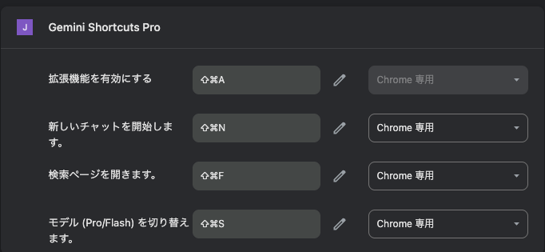

# Gemini Shortcuts Pro

> **これは Google Chrome のショートカット拡張機能です**

Google Geminiをより快適に操作するためのChrome拡張機能です。

## 主な機能
- モデル（Pro/Flash）切り替え
- 新しいチャットウィンドウの作成
- 過去プロンプトの検索ウィンドウ表示
- Deep ResearchボタンのON/OFF切り替え

## 使い方
1. Chrome拡張機能としてインストール
2. Geminiページ上で以下のショートカットが利用可能
   - モデル切り替え: `Ctrl+Shift+S`（Macは`Cmd+Shift+S`）
   - 新しいチャット: `Ctrl+Shift+N`（Macは`Cmd+Shift+N`）
   - 検索ウィンドウ: `Ctrl+Shift+F`（Macは`Cmd+Shift+F`）
   - Deep Research: `Ctrl+Shift+D`（Macは`Cmd+Shift+D`）

## 注意事項
- 本拡張機能はGoogle公式ではありません。
- GeminiのUI変更等により動作しなくなる場合があります。

## ライセンス
MIT License